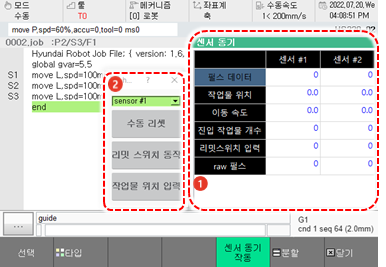

# 6.17 센서 동기

패널 선택창에서 \[센서 동기\]를 터치하십시오. 센서 동기창이 나타납니다.

컨베이어 및 프레스 동기 기능과 관련된 정보를 확인할 수 있습니다. 센서 동기 기능은 \[**시스템** &gt; 4: 응용 파라미터 &gt; 4: 센서 동기\] 메뉴에서 동기 상태를 컨베이어 또는 프레스로 설정하면 활성화됩니다.

<table>
  <thead>
    <tr>
      <th style="text-align:left">번호</th>
      <th style="text-align:left">설명</th>
    </tr>
  </thead>
  <tbody>
    <tr>
      <td style="text-align:left">
        
      </td>
      <td style="text-align:left">선택한 센서의 컨베이어
        및 프레스 동기 기능과
        관련된 정보를 표시합니다.</td>
    </tr>
    <tr>
      <td style="text-align:left">
        
      </td>
      <td style="text-align:left">
        <ul>
          <li>[sensor #1]: 드롭다운 메뉴를
            터치하여 모니터링할
            센서를 선택합니다.</li>
          <li>[수동 초기화]: 센서 관련
            각종 데이터(엔코더 펄스,
            센서 위치, 센서 속도, 작업물
            진입 개수, 동기 재생 상태
            등)를 수동으로 삭제합니다.</li>
          <li>[리밋 스위치 작동]: 리밋
            스위치를 수동으로 입력할
            경우 사용합니다.</li>
          <li>[작업 포지션 입력]: 센서의
            위치값(직선 mm, 원형 deg)을
            수동으로 입력합니다.</li>
        </ul>
      </td>
    </tr>
  </tbody>
</table>


센서 동기 기능에 대한 자세한 내용은 별도의 “Hi6 센서동기 기능 설명서”를 참조하십시오.


