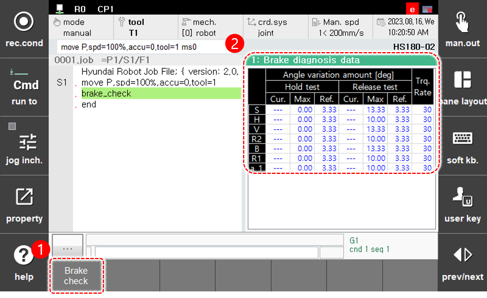

# 6.17 System Diagnosis

Touch \[system diagnosis\] in the panel selection window. Then, a window for brake diagnosis will appear.

<table>
  <thead>
    <tr>
      <th style="text-align:left">No.</th>
      <th style="text-align:left">Description</th>
    </tr>
  </thead>
  <tbody>
    <tr>
      <td style="text-align:left">
        
      </td>
      <td style="text-align:left">
        
[system diagnosis] In case where the panel is touched, you can switch the panel into another diagnosis by pushing the below items.

        <ul>
          <li>[Brake check] displays the brake diagnosis data.</li>
          <li>[Gas P. check] displays the gas spring pressure diagnosis data.</li>
        </ul>
      </td>
    </tr>
    <tr>
      <td style="text-align:left">
        
      </td>
      <td style="text-align:left">
        
Under each condition of brake hold or release, current torque, maximum torque, reference torque, and torque-applied ratio are displayed.

        <ul>
          <li>Current torque under diagnosis is displayed.</li>
          <li>In case of the reference setting mode, the axis name is colored yellow.</li>
        </ul>
      </td>
    </tr>
    <tr>
      <td style="text-align:left">
        
      </td>
      <td style="text-align:left">
        
 Reference pressure and estimated pressure of the gas spring are displayed.

        <ul>          
          <li>[Stop]: gas spring pressure in stationary-status diagnosis</li>
          <li>[Cmd]: gas spring pressure after executing corresponding command.</li>
        </ul>
      </td>
    </tr>
  </tbody>
</table>


* \[Gas P. check\] is allowed only to the diagnosis-supported robots.
* Refer to "Hi6 system diagnosis manual" for more details.


