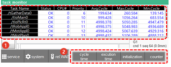

# 6.18 Task monitor

In the panel selection window, touch \[Task monitor\]. Then, the task window will appear.

You can check the operation cycle and execution time information for each task.

<table>
  <thead>
    <tr>
      <th style="text-align:left">No.</th>
      <th style="text-align:left">Description</th>
    </tr>
  </thead>
  <tbody>
    <tr>
      <td style="text-align:left">
        
      </td>
      <td style="text-align:left">
          <ul>Displays the operation cycle and execution time information for each task </ul>
      </td>
    </tr>
    <tr>
      <td style="text-align:left">
        
      </td>
      <td style="text-align:left">
        <ul>
          <li><b>[cycle time]/[execution time]</b>: You can change the information type
            for each task.</li>
          <li><b>[initialization]</b>: You can initialize the displayed information.</li>
          <li><b>[counter]</b>: You can regard the task as normal by checking the increasing counter.</li>
        </ul>
      </td>
    </tr>
  </tbody>
</table>

