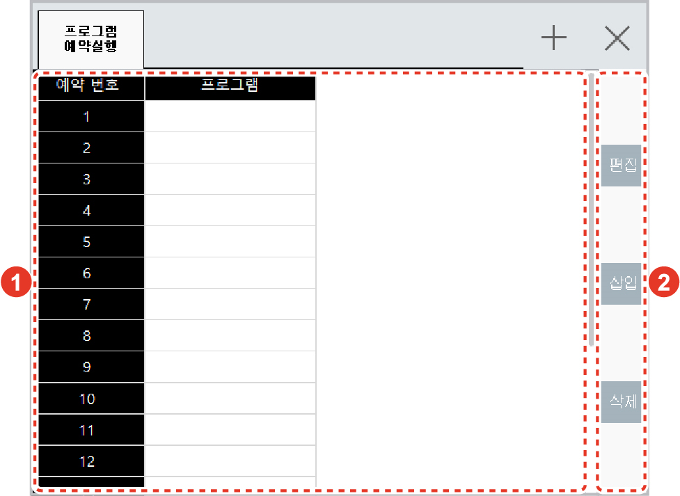

# 6.19 프로그램 예약실행

패널 선택창에서 \[프로그램 예약실행\]을 터치하십시오. 예약 실행창이 나타납니다.

외부 신호에 의해 프로그램을 예약하고 예약 순서에 따라 프로그램을 수행할 때, 예약 프로그램 목록에서 상태를 확인하고 변경할 수 있습니다.

<table>
  <thead>
    <tr>
      <th style="text-align:left">번호</th>
      <th style="text-align:left">설명</th>
    </tr>
  </thead>
  <tbody>
    <tr>
      <td style="text-align:left">
        
      </td>
      <td style="text-align:left">
        
예약 프로그램 목록입니다.
          1 ~ 20 개의 프로그램을 예약
          설정할 수 있습니다.

        <ul>
          <li>원격 모드에서 실행 중인
            프로그램이 종료되면
            예약 순서에 따라 프로그램이
            자동으로 실행됩니다.</li>
          <li>프로그램의 예약 실행이
            종료되면 목록에서 삭제됩니다.</li>
        </ul>
      </td>
    </tr>
    <tr>
      <td style="text-align:left">
        
      </td>
      <td style="text-align:left">
        <ul>
          <li>[편집]: 예약 프로그램
            목록을 편집합니다.</li>
          <li>[삽입]: 예약 프로그램
            목록에 예약 실행할 프로그램을
            추가합니다.</li>
          <li>[삭제]: 예약 프로그램
            목록에서 예약 프로그램을
            삭제합니다.</li>
        </ul>
      </td>
    </tr>
  </tbody>
</table>


* \[프로그램 예약실행\] 항목은 응용 기능 중 센서 동기 기능의 동기 상태를 컨베이어 또는 프레스로 설정한 경우에만 활성화됩니다.
* \[프로그램 예약실행\] 항목은 \[설정 &gt; 2: 제어 파라미터 &gt; 8: 프로그램 예약실행\] 메뉴에서 \[적용 레지스터 개수\] 옵션이 무효로 설정되어 있으면 활성화되지 않습니다.
* 프로그램 예약 실행에 대한 자세한 내용은 별도의 “Hi6 제어기 프로그램 예약 실행 기능 설명서”를 참조하십시오.


