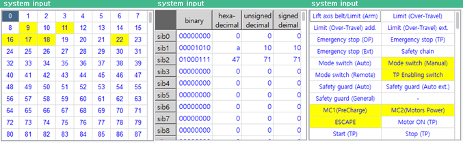

# 6.2.1 系统输入

在面板选择窗口中，触摸 `[System Input]`。然后，输入信号窗口将出现。

您可以检查与机器人操作相关的信号状态以及预先分配用于检测机器人和控制器发生的任何异常的输入信号状态。

* 在 ON/OFF 状态和序列状态中，当前输入的信号将以黄色显示。
* 
  在序列状态中，将仅显示控制器序列信号的状态。

* 
  `[ON/OFF]`/`[Value]`/`[Sequence]`：您可以通过触摸单选按钮更改输入信号窗口的显示模式。