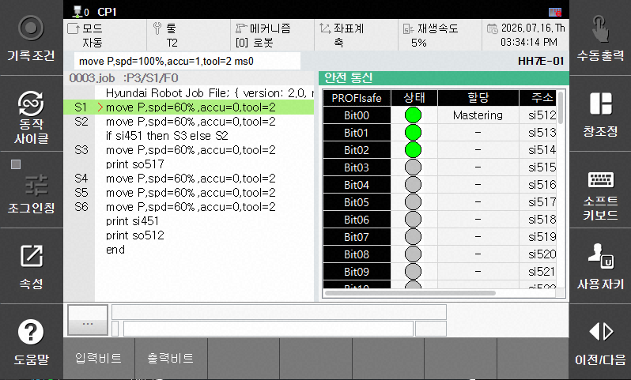

# 6.2.10 안전 통신


이 기능은 Hi7 제어기부터 지원됩니다.


패널 선택창에서 [안전 통신]을 선택하십시오. 
다음의 정보를 확인할 수 있습니다.  
- 안전 통신 선택 상태 (PROFIsafe or CIP Safety)
- 입출력 상태
- 안전 신호 할당 여부 
- 접근 가능한 내부 주소
 

하단의 [입력비트] [출력비트] 버튼을 눌러 모니터링 대상을 변경할 수 있습니다.
 
 
 
