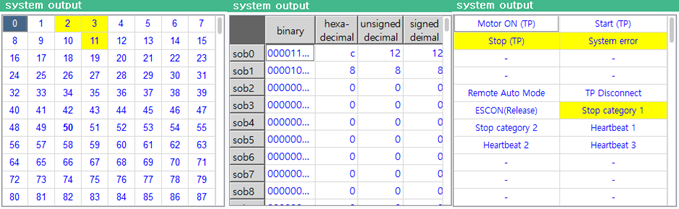
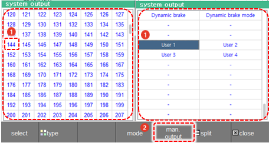
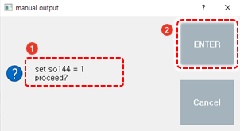
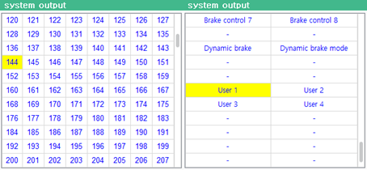

# 6.2.2 System Output

Touch \[System Output\] in the panel selection window. Then, the output signal window will appear.

You can check the signals related to the robot operation and check the status of brake control.

* In the ON/OFF status and sequence status, the signals currently being outputted will be displayed in yellow.
* In the sequence status, only the status of the controller sequence signals will be displayed.
* \[ON/OFF\]/\[Value\]/\[Sequence\]: You can change the display mode of the output signal window by touching the radio button.
* \[Manual output\]: You can force the output of the selected signals while in the ON/OFF and sequence status.

### Manual Output

You can select the desired signal and force it to be outputted.

1.	You can set the display mode to the ON/OFF status or sequence status by touching the \[ON/OFF\] or \[Sequence\] radio button on the right side of the system output signal window. 

2.	Touch a signal to select it in the signal window, and then touch the \[Manual Output\] button.

    

3.	After checking the output conditions in the manual output confirmation window, touch the \[ENTER\] button.

    

    | soN | =1/0 |
    | :---: | :---: |
    | N: Number of the signal to be outputted | Output status \(1: Output, 0: No output\) |

4.	Check the output status of the selected signal. The selected signal will be switched to the output status and displayed in yellow in the signal window.

    

