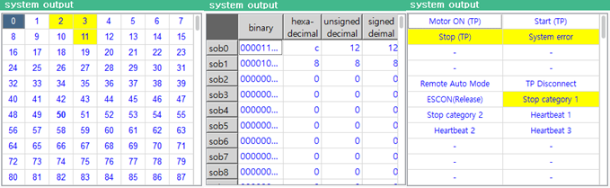
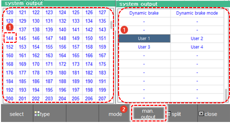
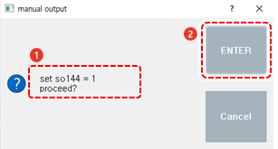
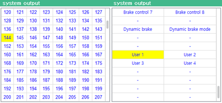

# 6.2.2 系统输出

在面板选择窗口中触摸 `[System Output]`。然后，输出信号窗口将会出现。

您可以检查与机器人操作相关的信号并检查制动控制的状态。

* 在 ON/OFF 状态和序列状态中，当前输出的信号将以黄色显示。
* 在序列状态中，仅显示控制器序列信号的状态。
* `[ON/OFF]`/`[Value]`/`[Sequence]`：您可以通过触摸单选按钮来更改输出信号窗口的显示模式。
* `[Manual output]`：您可以在 ON/OFF 和序列状态下强制输出所选信号。

### 手动输出

您可以选择所需信号并强制输出。

1. 您可以通过触摸系统输出信号窗口右侧的 `[ON/OFF]` 或 `[Sequence]` 单选按钮来设置显示模式为 ON/OFF 状态或序列状态。

2. 在信号窗口中触摸一个信号以选择它，然后触摸 `[Manual Output]` 按钮。

    

3. 在手动输出确认窗口中检查输出条件后，触摸 `[ENTER]` 按钮。

    

    | soN | =1/0 |
    | :---: | :---: |
    | N: 要输出的信号的编号 | 输出状态 \(1: 输出, 0: 不输出\) |

4. 检查所选信号的输出状态。所选信号将切换为输出状态并在信号窗口中以黄色显示。

    