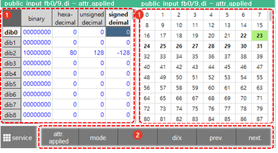

# 6.2.3 公共输入

在面板选择窗口中触摸 `[public Input]`。然后，公共输入信号窗口将出现。

您可以检查通过控制器的 I/O 板的 CNIN 连接器输入的公共输入信号的状态。

<table>
  <thead>
    <tr>
      <th style="text-align:left">编号</th>
      <th style="text-align:left">描述</th>
    </tr>
  </thead>
  <tbody>
    <tr>
      <td style="text-align:left">
        
      </td>
      <td style="text-align:left">
        
显示一般输入信号的状态

        <ul>
          <li>被指定为系统的基本规格或用户分配的一般输入信号将<b>以粗体</b>显示。</li>
          <li>当前输入的信号将以黄色显示。</li>
        </ul>
      </td>
    </tr>
    <tr>
      <td style="text-align:left">
        
      </td>
      <td style="text-align:left">
        <ul>
          <li>[FB0]：您可以通过触摸下拉菜单（FB0 - FB15）选择要监视的 FB 块。最多可以配置 16 个 I/O 块，并且可以监视 960 点信号。</li>
          <li><b>[ATTR.-APPLIED]</b>：您可以选中复选框以执行设置，以便在通过正/负逻辑属性之前显示物理输入值。基本设置（未选中）是显示经过正/负逻辑属性后的输入逻辑值。</li>
          <li>[开/关]/[值]：您可以通过触摸单选按钮更改信号显示模式。</li>
        </ul>
      </td>
    </tr>
  </tbody>
</table>


* 在使用信号时，例如通过嵌入式 PLC 映射的现场总线信号，输入信号的开/关状态可能会有所不同。
* 
  输入信号的流向如下所示。


