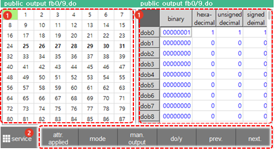
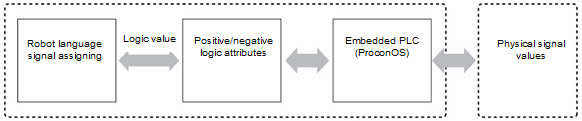
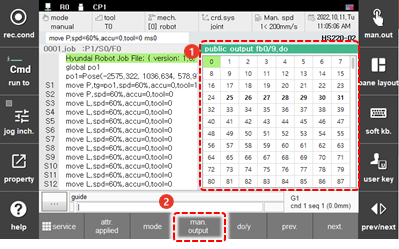
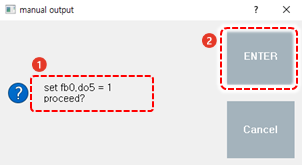
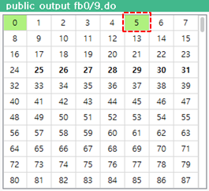

# 6.2.4 公共输出

在面板选择窗口中触摸 `[public Output]`。然后，公共输出信号窗口将出现。

您可以检查通过控制器的 I/O 板的 CNOUT 连接器输出的公共输出信号状态。

<table>
  <thead>
    <tr>
      <th style="text-align:left">编号</th>
      <th style="text-align:left">描述</th>
    </tr>
  </thead>
  <tbody>
    <tr>
      <td style="text-align:left">
        
      </td>
      <td style="text-align:left">
        
显示一般输出信号的状态

        <ul>
          <li>指定为系统基本规格或由用户分配的普通输出信号将以 <b>粗体</b> 显示。</li>
          <li>当前输出的信号将以黄色显示。</li>
        </ul>
      </td>
    </tr>
    <tr>
      <td style="text-align:left">
        
      </td>
      <td style="text-align:left">
        <ul>
          <li>[FB0]：您可以通过触摸下拉菜单选择要监控的 FB 块 (FB0 - FB15)。您可以配置最多 16 个 I/O 块，并且可以使用一个块监控 960 个信号点。</li>
          <li>[手动输出]：您可以强制选择的信号输出。</li>
          <li><b>[ATTR.-APPLIED]</b>：您可以勾选复选框，以使物理输入值在通过正/负逻辑属性之前显示。基本设置（未选中）是输入逻辑值在通过正/负逻辑属性之后将显示。</li>
          <li>[开/关]/[值]：您可以通过触摸单选按钮更改信号显示模式。</li>
        </ul>
      </td>
    </tr>
  </tbody>
</table>


* 在通过嵌入式 PLC 映射信号（如现场总线信号）的情况下，输出信号的开/关状态可能会有所不同。
* 
  输出信号的流向如下。


#### 

#### 手动输出

您可以选择所需的信号并强制其输出。

1.	您可以通过触摸一般输出信号窗口右侧的 `[ON/OFF]` 单选按钮，将显示模式设置为开/关状态。

2.	在信号窗口中触摸一个信号以选择它，然后触摸 `[手动输出]` 按钮。

    

3.	在手动输出确认窗口中检查输出条件后，触摸 `[ENTER]` 按钮。

    

| FbN | doN | =1/0 |
| :---: | :---: | :---: |
| N: 要监控的 FB 块的编号 | N: 要输出的信号的编号 | 输出状态 \(1: 输出, 0: 无输出\) |

4.	检查所选信号的输出状态。所选信号将切换到输出状态并在信号窗口中以黄色显示。

    