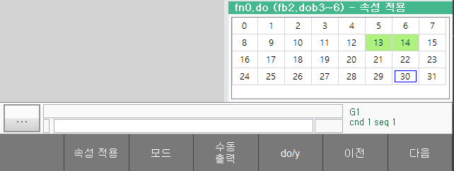

# 6.2.5 fn 输入，fn 输出

您可以通过指定 fb 对象的特定区域来定义 fn 对象。
如果 ${cont_model} 控制器是一个现场总线主设备，并且有多个现场总线从设备，您可以将每个从设备的区域设置为每个 fn 对象，以直观地处理这些从设备。

设置的 fn 对象可以像机器人语言和嵌入式 PLC 中的 fb 对象一样使用。

在面板选择窗口中选择 `[fn input]` 或 `[fn output]`。fn 输入或输出面板会出现，您可以检查每个 fn 对象的输入和输出信号的值。

有关如何设置 fn 对象的信息，请参考下面的链接。

[7.3.2.12 fn 块分配](../../7-system/3-control-parameter/2-io-signal-setting/12-fn-block?cont_model=${cont_model})

单击 '[F6:prev]' / '[F7:next]' 按钮以更改要显示的 fn 对象的数量。

其余 F 按钮的使用与 [6.2.3 公共输入](./3-user-input.md) 和 [6.2.4 公共输出](./4-user-output.md?cont_model=${cont_model}) 监视窗口相同。

