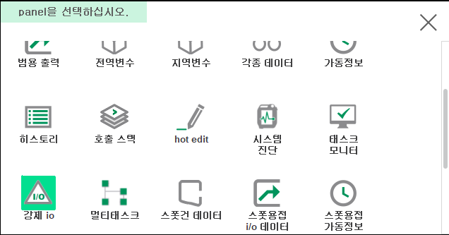
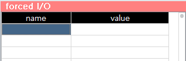
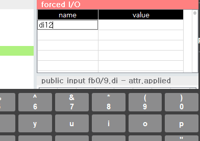
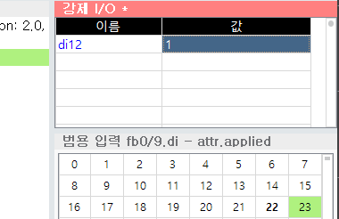
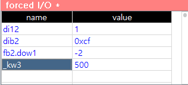
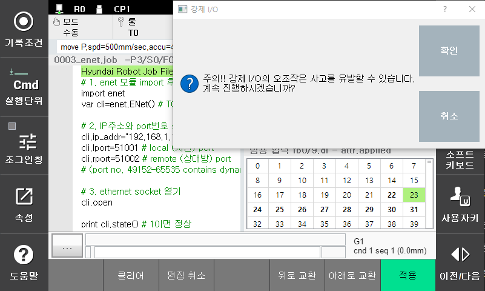
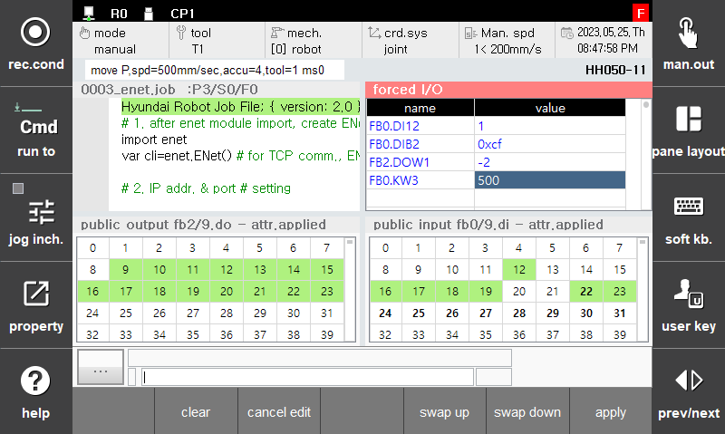
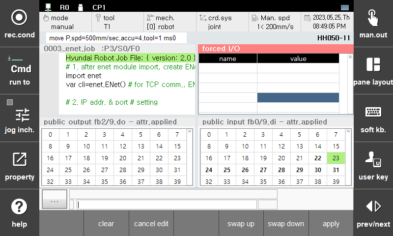

# 6.2.6 强制 IO

您可以在强制 IO 面板中注册 IO 继电器变量，以强制某些更改的 IO 值。


* 此功能仅用于测试或问题分析。
* 强制 IO 功能的误操作可能会导致严重事故，例如碰撞、掉落和人员伤亡。仅在您充分了解系统的 IO 连接并清楚预测强制值更改的后果时谨慎使用。
* 在测试和问题分析后，请务必完全清除强制 IO 并将其恢复到正常 IO 状态。



#### 打开强制 IO 面板

1. 分割屏幕并按左下角的 [选择] 按钮。

&nbsp;

2. 在面板选择窗口中双击 `强制 io (forced io)`。强制 I/O 面板打开。

#### 如何使用

选择 `名称 (Name)` 列，输入所需的 IO 继电器变量名称，然后按 `确认 (ENTER)` 键将变量注册到表中。  
(您可以通过再次单击名称列来修改您输入的变量名称。)

选择 `力控制变量 (Value)` 列，输入您想要应用的新 IO 值，然后按 `确认 (ENTER)` 键。

如果您有更多要应用的强制 IO 条目，请以同样的方式输入。您最多可以输入 100 个条目。

面板标题栏上的 * 标记表示表格已被修改，并且此修改尚未应用。  
按 [F7: 应用] 按钮以应用强制 IO。  
当您在警告消息框中按 `确认 (OK)` 按钮时，所有强制 I/O 条目将被应用。

面板标题栏上的 * 标记消失，您可以看到强制 IO 值已被应用。  
标题栏上的红色 F 标记闪烁。这是强制 IO 正在应用的警告。

* 在编辑过程中按 `SHIFT+DEL` 删除项目。
* 您可以通过按 [F5: 上移]、[F6: 下移] 按钮来改变项目的顺序。
* 如果在编辑表时单击 [F3: 取消编辑]，它将重新加载最后应用的状态。

在完成测试和问题分析后，请务必按 [F2: 清除] 按钮以完全清除强制 IO。


* 如果多个条目强制相同继电器（或重叠位）冲突的值，则强制为表格中下方项目的值。
* 当 ${cont_model} 控制器断电时，所有注册为强制 IO 的内容将被清除。

