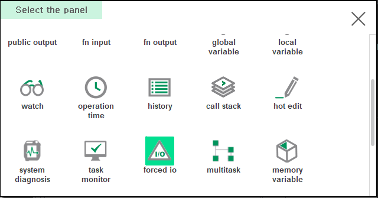

# 6.2.6 Forced IO

You can register IO relay variables in the Force IO panel to force some changed IO values.


* This function is only for testing or problem analysis.
* Misoperation of forced IO function can cause serious accidents such as collisions, drops, and casualties. Use with caution only if you fully understand the system's IO connections and clearly predict the consequences of the forced value change.
* After testing and problem analysis, be sure to clear the forced IO completely and restore it to a normal IO state.



## Opening forced IO panel

1. Split the screen and press the [Select] button on the bottom left.

&nbsp;

2. Double-click `forced io` in the panel selection window. Forced I/O panel opens.

## How to use

Select the `Name` column, type the desired IO Relay variable name, and press the `ENTER` key to register the variable in the table.  
(You can modify the variable name you entered by clicking the Name column once more.)

Select the `Value` column, type the new IO value you want to apply, and press the `ENTER` key.

If you have more forced IO entries to apply, enter them in the same way. You can enter up to 100 entries.

The * mark on the panel title bar means that the table has been modified and this modification has not yet been applied.
Press the [F7: Apply] button to apply the forced IO.
The moment you press the `OK` button in the warning message box, all forced I/O entries are applied.

The * mark on the panel title bar disappears, and you can see that the forced IO value is applied.
A red F mark flashes on the title bar. It is a warning that forced IO is being applied.

* Press `SHIFT+DEL` to delete an item during editing.
* You can change the order of the items by pressing the [F5: Swap Up], [F6: Swap Down] buttons.
* If you click [F3: Cancel edit] while editing a table, it will reload the last applied state.

After completing the test and problem analysis, be sure to press the [F2: Clear] button to fully clear the forced IO.


* If multiple entries force conflicting values for the same relay (or overlaid bits), they are forced to the value of the lower item of the table.
* When the Hi6 controller is powered off, all contents registered as forced IO are cleared.


