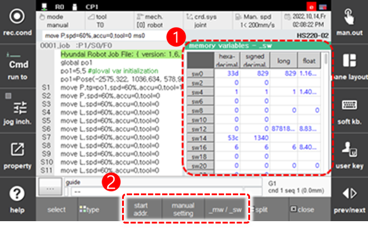

# 6.2.7 内存变量

在面板选择窗口中触摸 `[memory variables]`。
来自机器人语言的可访问变量显示在内部 PLC 继电器中。

 

<table>
  <thead>
    <tr>
      <th style="text-align:left">编号</th>
      <th style="text-align:left">描述</th>
    </tr>
  </thead>
  <tbody>
    <tr>
      <td style="text-align:left">
        
      </td>
      <td style="text-align:left"> 
      <ul>
          以十六进制、带符号十进制、长整型和浮点格式显示数据内存 (mw) 和系统内存 (sw) 的当前值。
      </ul>
      </td>
    </tr>
    <tr>
      <td style="text-align:left">
        
      </td>
      <td style="text-align:left">
        <ul>
          <li>[start addr.]: 选择此按钮并在对话框中输入起始地址以在屏幕的第一行显示。</li>
          <li>[manual setting]: 在屏幕上选择所需的地址单元并单击此按钮以输入新值。</li>
          <li>[_mw/_sw]: 单击此按钮在显示 mw 和 sw 变量之间切换。</li>
        </ul>
      </td>
    </tr>
  </tbody>
</table>