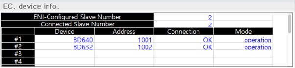

# 6.2.8 EtherCAT 设备

在面板选择窗口中，触摸 `[EtherCAT dev.]`。此监控面板显示从属设备列表及其网络状态，这些设备与 ${cont_model} 控制器内部和外部组成 EtherCAT 网络。在 EtherCAT 网络中，控制器主板作为主设备工作。

 

-	ENI-配置的从属设备数量：构成 EtherCAT 网络的从属设备数量
-	连接的从属设备数量：当前连接的从属设备数量，应与 'ENI-配置的从属设备数量' 相同
-	设备：与主板连接的 EtherCAT 从属设备名称
-	地址：EtherCAT 网络上的唯一地址
-	连接
    -	NG：网络故障
    -	OK：网络成功
-	模式
    -	未知：由于网络故障而无法检查当前状态
    -	初始化：网络通道已初始化的状态
    -	预操作：从属设备只能通过非周期邮箱进行通信的状态
    -	安全操作：从属设备仅能通过传输数据（Tx PDO）进行通信的状态
    -	操作：从属设备可以同时传输和接收数据（Tx/RxPDO）的状态