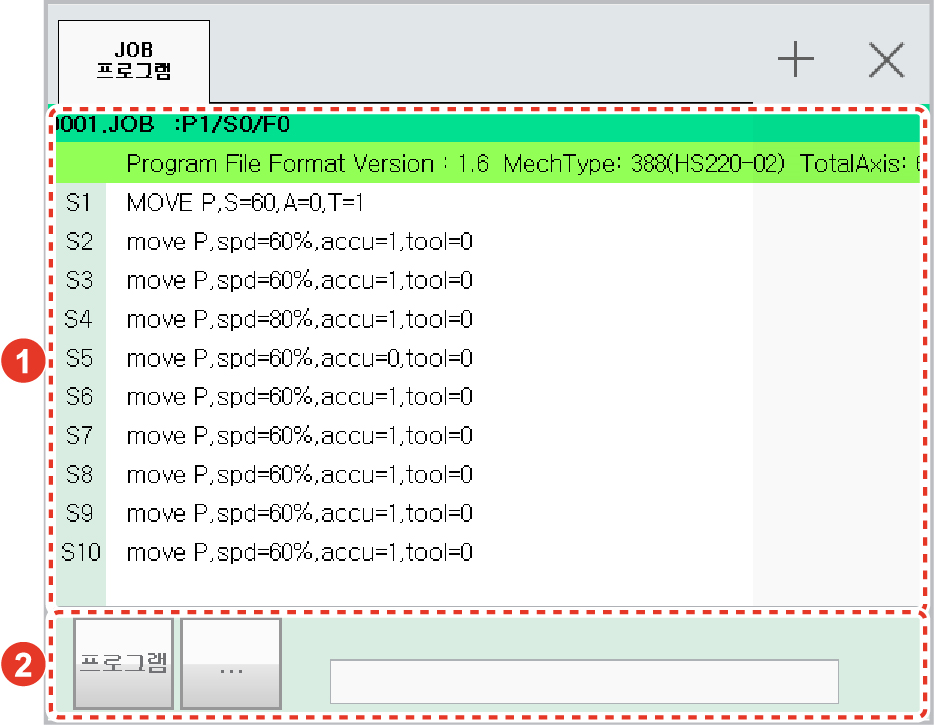

# 6.2 job

패널 선택창에서 \[job\]을 터치하십시오. JOB 프로그램창이 나타납니다. 프로그램을 확인하고 편집 및 삭제하거나 작성할 수 있습니다.

<table>
  <thead>
    <tr>
      <th style="text-align:left">번호</th>
      <th style="text-align:left">설명</th>
    </tr>
  </thead>
  <tbody>
    <tr>
      <td style="text-align:left">
        
      </td>
      <td style="text-align:left">프로그램의 기본 정보와
        명령문을 표시합니다.
        명령문의 상세 정보를
        확인하고 편집할 수 있습니다.</td>
    </tr>
    <tr>
      <td style="text-align:left">
        
      </td>
      <td style="text-align:left">
        <ul>
          <li>[프로그램]: 작성된 프로그램
            목록에서 프로그램을
            선택하거나 삭제합니다.
             
          </li>
          <li>[…]: 자동 들여쓰기가
            잘못 적용된 경우 JOB 프로그램의
            자동 들여쓰기를 다시
            수행합니다.
             
          </li>
          <li>프로그램 작성 시 선택한
            명령문의 인수값은 입력
            영역에 표시됩니다.</li>
        </ul>
      </td>
    </tr>
  </tbody>
</table>


프로그램의 관리 및 작성 방법에 대한 자세한 내용은 “[3 프로그램 작성](../programming/)”을 참조하십시오.


