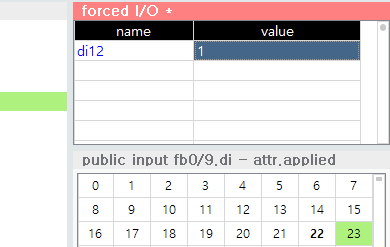
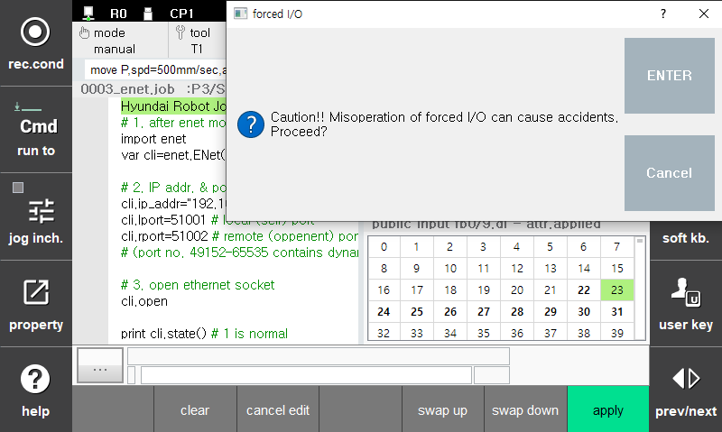
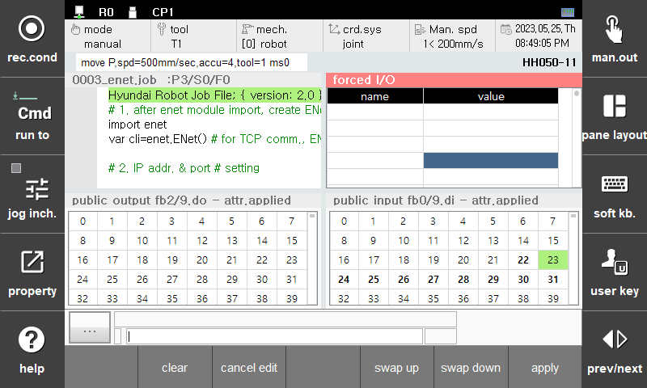

# 6.20 강제 IO (forced io)

강제 IO 창에는 원하는 IO 릴레이 변수를 등록하여, 변경된 IO 값을 강제로 적용 할 수 있습니다.


* 시험 혹은 문제 분석을 위한 기능입니다.
* 강제 IO의 오조작은 충돌, 낙하, 인명피해 등 심각한 사고를 유발할 수 있습니다. 해당 IO의 구성을 완전히 이해하고 값 변경의 결과를 명확히 예측하는 경우에만 신중을 기해 사용하십시오.
* 시험 및 문제 분석이 끝나면, 반드시 강제 IO를 전체 클리어하여 정상적인 IO 상태로 복구해 주십시오.



## 강제 IO 창 열기

1. 화면을 분할하고 좌측 하단의 [선택] 버튼을 누릅니다.

&nbsp;

2. 패널 선택창에서 `강제 io`를 더블클릭하십시오. 강제 I/O 창이 열립니다.

## 사용 방법

이름 열을 선택한 후 원하는 IO 릴레이 변수명을 타이핑하고 `ENTER` 키를 누르면, 테이블에 해당 변수가 등록됩니다.  
(이름 칸을 한번 더 클릭하여 입력한 변수명을 수정할 수 있습니다.)

값 열을 선택한 후 적용할 새 IO 값을 타이핑하고 `ENTER` 키를 누르십시오.

적용할 강제 IO 항목이 더 있으면 마찬가지 방법으로 입력하십시오. 최대 100개의 항목을 입력할 수 있습니다.

panel 제목 막대의 * 표시는 테이블이 수정되었고 이 수정 내용이 아직 적용되지 않았다는 의미입니다.
강제 IO를 적용하려면 [F7: 적용] 버튼을 누르십시오.
경고 메시지박스에서 `확인` 버튼을 누르는 순간 강제 I/O 항목들이 일괄 적용됩니다.

panel 제목 막대의 * 표시는 사라지고, 강제 IO값이 적용된 것을 확인할 수 있습니다. 제목 막대에는 빨간색의 F가 점멸하는데, 이것은 강제 IO가 적용되고 있음을 경고하는 표시입니다.

* 편집 중 항목을 삭제할 때는 `SHIFT+DEL`을 누르십시오.
* [F5: 위로 교환], [F6: 아래로 교환] 버튼을 눌러 항목의 순서를 바꿀 수 있습니다.
* 테이블을 편집하다가 [F3: 편집 취소]를 누르면, 마지막으로 적용된 상태를 다시 불러옵니다.

시험 및 문제 분석이 끝나면, 반드시 [F2: 클리어] 버튼을 눌러 강제 IO를 전체 클리어하십시오.


* 여러 개의 항목이 같은 릴레이(혹은 겹쳐진 bit들)에 대해 서로 상반된 값을 강제한 경우, 테이블의 아래쪽 항목의 값으로 강제됩니다.
* Hi6 제어기의 전원을 끄면 강제 IO로 등록된 내용은 모두 클리어됩니다.


