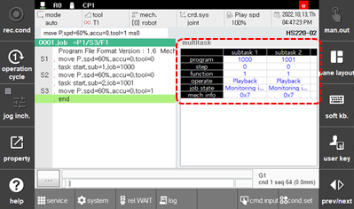

# 6.21 Multi-task

Touch \[multitask\] in the panel selection window.
This displays the information of the programs that are run automatically in the main task and the sub tasks 1 – 7, including the steps, functions, operating state, and work state.

 

 


 Refer to 『Hi6 Controller Multitasking Function Manual』for details.
