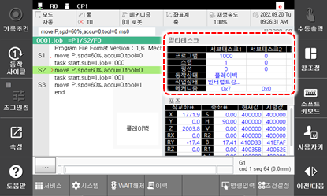

# 6.21 멀티 태스크

패널 선택창에서 \[멀티 태스크\]을 터치하십시오. 멀티 태스킹 사용 시 현재 메인 태스크와 서브 태스크 1-7에 자동 운전 중인 프로그램, 스텝, 펑션, 동작상태, 작업상태를 표시합니다. 

 

 


 상세 내용은 "[멀티태스크 기능설명서](https://hrbook-hrc.web.app/#/view/doc-multi-task/korean/README)"를 참조하여 주십시오.
