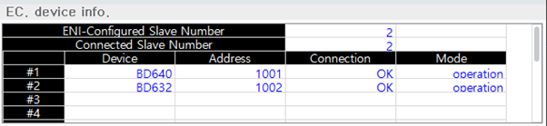

# 6.24 EtherCAT device

In the panel selection window, touch \[EtherCAT dev.\]. This monitoring panel shows the slave device list and the devices' networking status, which compose a EtherCAT network with Hi6 controller internally and externally. In the EtherCAT network, the controller main board works as a master.

 

-	ENI-Configured Slave Number: the number of slave devices composing the EtherCAT network 
-	Connected Slave Number: the number of current connected slave devices, which is supposed to be the same as 'ENI-Configured Slave Number' 
-	Device: the device name of the EtherCAT slave connected with the main board
-	Address: a unique address on the EtherCAT network
-	Connection
    -	NG: network failure
    -	OK: network success
-	Mode
    -	Unknown: a status where it impossible to check the current status due to network failure
    -	Init: a status where the network channel has been initialized
    -	pre-op: a status where a slave device can communicate only by using non-periodic mail-box
    -	safe-op: a status where a slave device can communicate only transmitting data(Tx PDO)
    -	operation: a status where a slave device can communicate both transmitting and receiving data(Tx/RxPDO)
