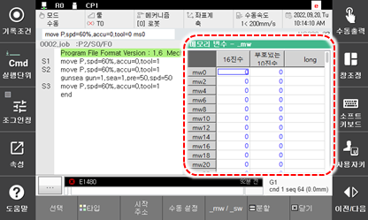

# 6.22 메모리 변수

패널 선택창에서 \[메모리 변수\]를 터치하십시오. 내장PLC 릴레이들 중 로봇언어에서 접근 가능한 변수를 표시합니다. 

 

<table>
  <thead>
    <tr>
      <th style="text-align:left">번호</th>
      <th style="text-align:left">설명</th>
    </tr>
  </thead>
  <tbody>
    <tr>
      <td style="text-align:left">
        
      </td>
      <td style="text-align:left"> 
      <ul>
          데이터 메모리(mw)와 시스템 메모리(sw)의 현재 값을 16진수, 부호있는 10진수, long형, float형 등으로 표시합니다.
      </ul>
      </td>
    </tr>
    <tr>
      <td style="text-align:left">
        
      </td>
      <td style="text-align:left">
        <ul>
          <li>[시작주소]: 해당 버튼을 선택한 후 대화상자에 시작주소를 입력하면 입력주소를 화면 첫줄에 표시합니다.</li>
          <li>[수동설정]: 화면의 원하는 주소셀을 선택한 후 해당 버튼을 누르면 원하는 값으로 기록할 수 있습니다.</li>
          <li>[_mw/_sw]: 해당버튼을 누르면 mw변수와 sw변수를 전환하여 보여줍니다.</li>
        </ul>
      </td>
    </tr>
  </tbody>
</table>