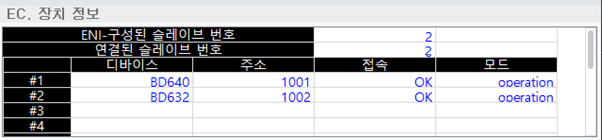

# 6.23 EtherCAT 장치 

패널 선택창에서 [EC. 장치정보]를 선택하십시오. Hi6 제어기 내/외부 EtherCAT 네트워크를 구성하는 슬레이브 장치 목록과  장치 연결 상태를 보여줍니다. EtherCAT 네트워크에서 제어기 메인보드는 EtherCAT 마스터로 동작합니다.
 

 

-	ENI-구성된 슬레이브 번호: 제어기 EtherCAT 네트워크를 구성하는 슬레이브 장치 개수
-	연결된 슬레이브 번호: 현재 연결된 슬레이브 장치 개수, 'ENI-구성된 슬레이브 번호' 개수와 동일해야 한다.
-	디바이스: 메인보드와 연결된 EtherCAT 슬레이브 장치명
-	주소: EtherCAT 네트워크 상 고유주소
-	접속
    -	NG: 통신불능
    -	OK: 연결상태
-	모드
    -	Unknown: 통신불능 상태로 인해 현재 상태를 알 수 없음
    -	Init: 통신 채널 초기화
    -	pre-op: 비주기 메일박스를 이용한 통신만 가능한 상태
    -	safe-op: Slave 장치의 송신(Tx PDO) 데이터만 교신 가능한 상태
    -	operation: Slave 장치의 송수신(Tx/RxPDO) 데이터 모두 교신 가능한 상태
