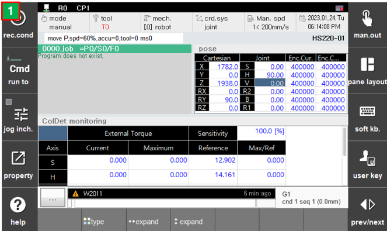
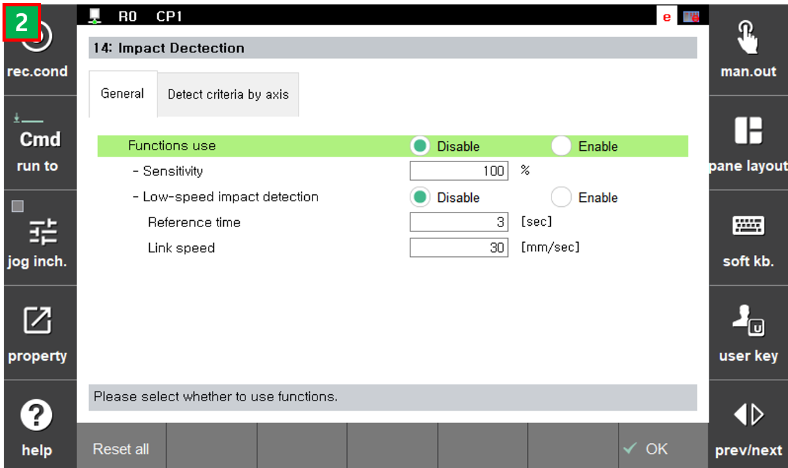

# 6.24 충돌검지 모니터링
 
 
 
 

충돌검지 모니터링 

 - [Sensitivity] : 비율 값으로 높을 수록 민감하게 충돌을 검지 (0: 무효) [0~200]
   - Fig2. [System>3:Robot parameter>14:Impact Detection] General 탭에서 [Sensitivity] 값을 설정 할 수 있다. 
 - [External Torque]-[Current] : 현재 추정되는 외력 토크 [Nm]
 - [External Torque]-[Maximum] : 추정되는 외력 토크 중 최대값 [Nm]
 - [Reference] : 충돌이라 판단하는 토크 임계값 [Nm]
 - [Max/Ref] : [Maximum]값과 [Reference]값의 비율로서, 1 이상이 되면 해당 축에 충돌이 있다고 판단 
