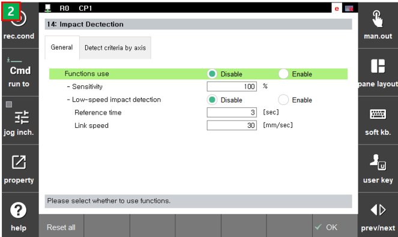

# 6.24 Coldet Monitoring

 
 
 
ColDet monitoring 

 - [Sensitivity] : The higher the ratio value, the more sensitive the collision is detected. (0: Disabled) [0~200]
   - It can be set in the General tap [System>3:Robot parameter>14:Impact Detection]  
 - [External Torque]-[Current] : Currently estimated external torque [Nm]
 - [External Torque]-[Maximum] : Maximum value of the current external torque[Nm]
 - [Reference] : Threshold torque value [Nm]
 - [Max/Ref] : The ratio [Maximum] to [Reference], if the value is over the one, axis impact would be occurred. 