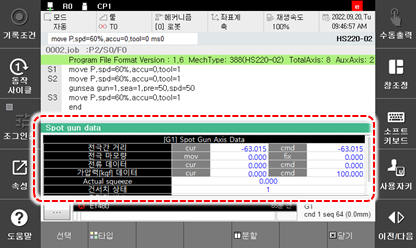

# 6.25 스폿 용접 데이터

패널 선택창에서 \[스폿\]을 터치하십시오. 스폿용접의 입출력 신호와 각종 데이터, 가동정보를 표시합니다. 

 

 


 상세 내용은 스폿 용접 기능 설명서의 “[3.1 모니터링](https://hrbook-hrc.web.app/#/view/doc-spot-weld/korean/3-Related-functions/3-1-monitoring/README)”를 참조하십시오.


