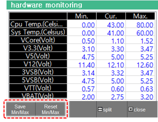

# 6.26 Hardware

 In the panel selection window, touch \[hardware\]. You can monitor current voltage and temperature of the COM module. In the case that a status value is out of the tolerance, a warning message will be issued in the period of 24 hours.

 
 
 
- If you want to change the tolerance, select the corresponding cell and edit it. Then, press the [Save Min/Max] button.
- If you want to initialize with default values, press the [Reset Min/Max] button.
