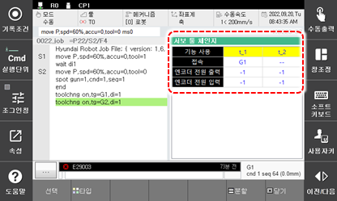

# 6.28 서보툴 체인지

패널 선택창에서 \[서보툴 제인지\]을 터치하십시오. 서보툴 체인지 기능 사용 시 서보툴의 상태와 엔코더 전원투입 입/출력 상태를 표시합니다. 

 

 


 상세 내용은 "[서보툴 체인지 기능설명서](https://hrbook-hrc.web.app/#/view/doc-svtool-change/korean/README)"를 참조하여 주십시오.


