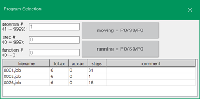
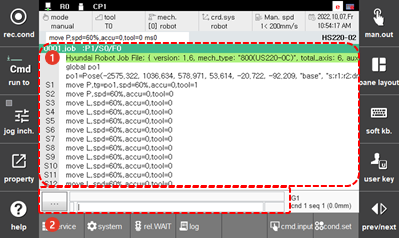

# 6.3.1 工作

在面板选择窗口中触摸 `[job]`。要查看总程序列表，按 `[SHIFT]`+`[PROG]` 键将进入程序选择窗口。然后，您可以创建、删除和选择程序。

您可以在任务编辑窗口中修改所选的工作程序。

<table>
  <thead>
    <tr>
      <th style="text-align:left">编号</th>
      <th style="text-align:left">描述</th>
    </tr>
  </thead>
  <tbody>
    <tr>
      <td style="text-align:left">
        
      </td>
      <td style="text-align:left"> <ul>  `[SHIFT]`+`[PROG]` : 在程序选择窗口中，您可以创建、删除或选择程序。 </ul> </td>
    </tr>
    <tr>
      <td style="text-align:left">
        
      </td>
      <td style="text-align:left">
        <ul> 基本信息和命令会显示出来。您可以检查并修改每个命令的详细情况。
        </ul>
      </td>
    </tr>
    <tr>
      <td style="text-align:left">
        
      </td>
      <td style="text-align:left">
        <ul>
          <li> <b>[&#x2026;]</b>: 如果自动缩进应用不正确，
            可以再次在 JOB 程序中执行自动缩进。</li>
          <li>在编写程序时，所选语句的参数值
            将显示在输入区域。</li>
        </ul>
      </td>
    </tr>
  </tbody>
</table>


有关如何管理和编写程序的详细信息，请参阅 "[3 Program Writing](../../3-programming/README.md?cont_model=${cont_model})"。
