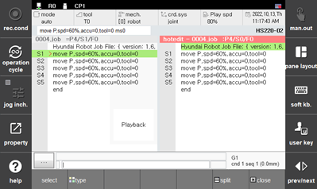
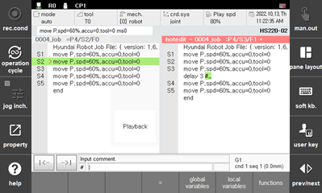
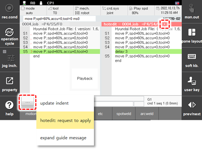

# 6.3.2 热编辑

这是在播放仍在运行时编辑程序的功能。


* 当你编辑并应用当前处于自动操作中的程序或即将被调用的程序时，它将在下一个循环中应用（在程序结束执行后）并使用编辑过的程序回放机器人。请务必小心，因为错误的编辑可能导致重大事故，例如机器人与夹具之间的碰撞。

  

### 入口

触摸面板上的 `[hot edit]` 按钮，当前程序的热编辑窗口将被打开。

 

### 可编辑的类型

虽然操作与手动模式相同，但以下功能不可使用。

1) `[REC]` 键（记录隐藏姿态移动）：显示“在热编辑状态下不允许操作”消息。
2) `[POS. MOD]` 键：显示“在热编辑状态下不允许操作”消息。

    

 

### 反映

如果你完成了程序编辑，点击指南显示栏左侧的按钮  打开弹出菜单，并选择 [hotedit: request to apply]。

 

实际反映的时间在以下表中显示。

<u>V60.32-03 或更高版本：</u>
<table>
<thead>
  <tr>
    <th>状态</th>
    <th>程序</th>
    <th>请求后，反映时间</th>
  </tr>
</thead>
<tbody>
  <tr>
    <td rowspan="2">无论  是否运行 或 运行中</td>
    <td>未运行程序 (不在调用栈中的作业)</td>
    <td>立即应用</td>
  </tr>
  <tr>
    <td>正在运行程序 (在调用栈中的作业)</td>
    <td>在循环结束时 或 RESET 0</td>
  </tr>
</tbody>
</table>
 

 
<u>V60.32-02 或更早版本：</u>

<table>
<thead>
  <tr>
    <th>状态</th>
    <th>程序</th>
    <th>请求后，反映时间</th>
  </tr>
</thead>
<tbody>
  <tr>
    <td>未运行</td>
    <td>-</td>
    <td>立即应用</td>
  </tr>
  <tr>
    <td rowspan="2">运行中</td>
    <td>未运行程序 (不在调用栈中的作业)</td>
    <td>立即应用</td>
  </tr>
  <tr>
    <td>正在运行程序 (在调用栈中的作业)</td>
    <td>在循环结束时</td>
  </tr>
</tbody>
</table>

 

### 标题栏显示

当前状态符号显示在热编辑窗口标题栏的右侧。

'*' 符号表示教学程序已经被修改，并且与当前运行的程序不同。

'>' 符号表示在程序运行时已经请求热编辑。

' '（空白）符号意味着请求尚未反映，或已经反映，因此程序与运行的程序相同。

 

### 不同程序选择

当你按下 `[SHIFT]` + `[PROG]` 键时，可以选择不同的程序。你也可以创建一个新程序。