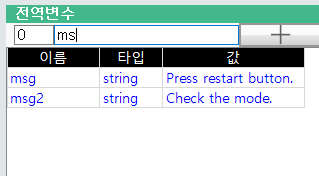
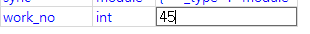
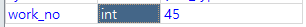
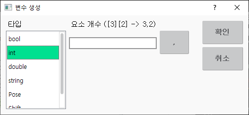
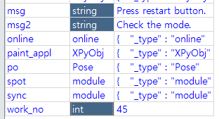
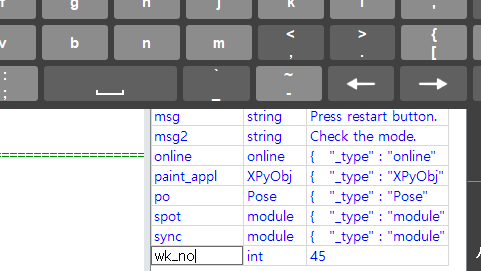
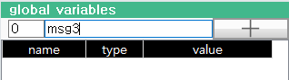
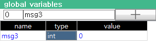
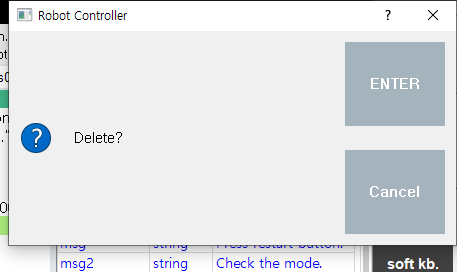

# 6.3.3.1 基本特征

##### 寻找变量

如果由于变量数量众多而难以找到所需的变量，请在顶部的过滤器中只输入变量名称的一部分。仅显示以您输入的过滤字符串开头的变量，便于查找。

##### 更改变量的值（对于 bool、int、double、string 类型）

选择所需变量的 `值 (value)` 列并输入新值。
按 ENTER 键以将输入的值应用于该变量。

##### 更改变量的值（对于 pose、shift 类型）

选择所需姿态或位移变量的 `值 (value)` 列。

按 ENTER 键打开姿态或位移属性窗口。
编辑后，单击 [F7: OK] 按钮。

##### 更改变量类型

选择所需变量的 `类型 (type)` 列并按 ENTER。将出现如下所示的创建变量对话框。

从类型列表中选择所需类型，然后单击 OK 按钮以更改变量的类型。请注意，如果类型更改，值将被初始化。

您还可以选择多个变量的类型，并按 ENTER 一次性更改它们。
（您可以通过按SHIFT+向上/向下箭头键选择多个连续单元格。或者，您可以在按住 CTRL 键的同时触摸多个单元格进行选择。）

##### 重命名变量

选择您想要的变量的 `名称 (name)` 列，然后打开软键盘输入新名称。
按 ENTER 键将其更改为您输入的名称。

##### 创建变量

在顶部的过滤器中输入您要创建的变量名称。

确认没有重复名称的变量，然后单击过滤器旁边的 + 按钮。变量将以默认类型 `int`（整数）创建。使用上述方法更改创建的变量的类型。

##### 删除变量

选择您要删除的变量。
按 DEL (CTRL+BACKSPACE) 键以显示确认/取消对话框。确认变量名称后，按 OK 按钮。

