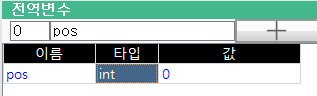
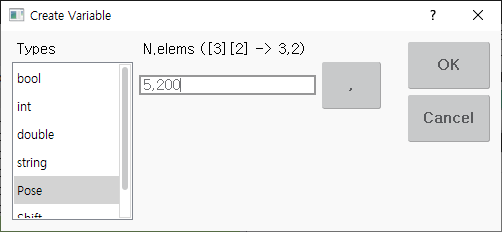
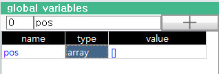
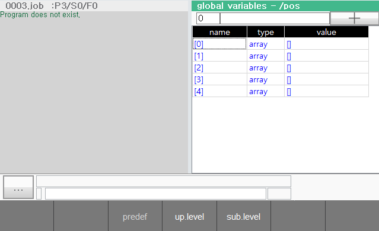
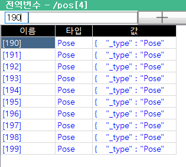
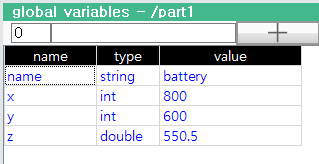

# 6.3.3.2 数组和对象

##### 创建数组

我们现在将使用一个生成 5x200 的二维姿态数组变量 `pos` 的示例。
使用上述描述的方法创建一个名为 `pos` 的变量。



选择 `类型 (type)` 列并按下 ENTER 键。创建变量对话框如下所示。



在类型列表中选择 `姿势 (Pose)`。如果输入 5,200 作为元素的数量并按下 OK 按钮，pos 的类型将变为 Pose[5][200] 的数组。




`[Warning]` 请注意，定义一个过大的数组可能会导致保存或加载的时间更长，并可能在断电的情况下无法自动保存。



##### 查看和更改数组元素值

数组变量的值仅显示为 []，元素的值不显示。
选择 `值 (value)` 列并按下 ENTER 键或点击 [F5: sub.level] 按钮以展开数组到下一级并查看元素值。



您还可以通过上述描述的方法更改数组元素的值或类型。

在二维数组 `pos` 中，`pos[0]` ~ `pos[4]` 也是数组。按 ENTER 或 [F5] 继续进入下一级。当前显示的数组的级别和索引可以在全局变量面板的标题栏中找到。

点击 [F4: up.level] 按钮或按 ESC 键返回到上一级。



因为数组一次只显示 100 个元素，默认情况下您只能看到 [0] 到 [99] 的索引范围。如果更改左上角的起始索引编辑框中的值，您可以查看其他元素范围。例如，如果在 `/pos[4]` 的起始索引中输入 190，则可以看到 [190]~[199] 的元素。

##### 查看和更改对象属性值

选择对象变量的 `值 (value)` 列并按下 ENTER 键或点击 [F5: sub.level] 按钮以展开对象到下一级并查看属性值。操作方法与数组变量类似。然而，启动索引编辑框不使用。




<br>

##### 固定变量

例如，您已经在全局变量窗口中创建了大量名为 `weld_points` 的姿态，通过执行以下赋值语句可以删除所有数据。

```python
weld_points=0
```

通过将变量指定为固定，您可以防止此错误。


如果在全局变量窗口的顶层选择数组变量并按下 [F4: toggle fixed]，类型将从 'array' 更改为 'F.array'（固定数组）。
如果指定为固定变量，则无法分配其他值。当 `weld_points` 是一个固定的二维数组时，以下每个赋值语句的结果与注释相同。

```python
global weld_points  # ignored.
global weld_points=0  # cannot assign error occurs
weld_points=0  # cannot assign error occurs
weld_points[2]=Array[30]  # new value can be assigned to an element
weld_points[2][1]="light"  # new value can be assigned to an element
weld_points[2][1].j2=90.5  # new value can be assigned to an property
```

如果再次执行 [F4: toggle fixed]，固定将被释放，`F.array` 将恢复为 `array`。