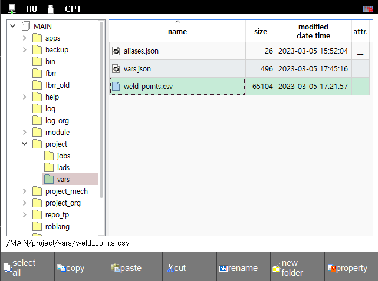
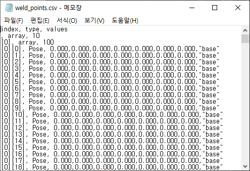
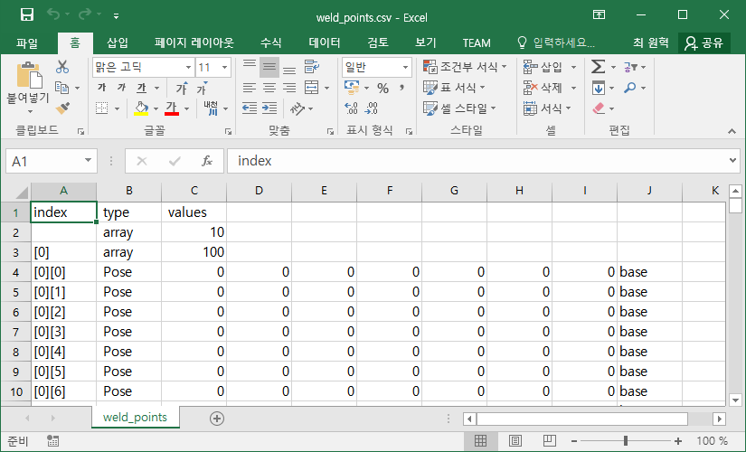
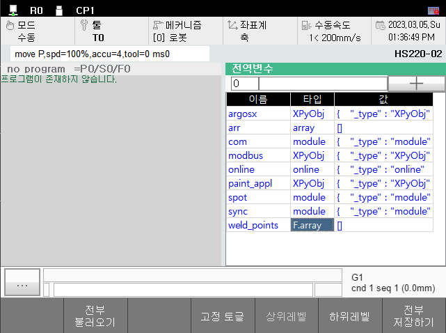

# 6.3.3.3 变量文件

变量值也作为文件保存，因为它们必须在断电时仍然保留，并且全局变量根据类型以两种形式存储：

<table>
  <thead>
    <tr>
      <th style="text-align:left">类型</th>
      <th style="text-align:left">路径名</th>
      <th style="text-align:left">描述</th>
    </tr>
  </thead>
  <tbody>
    <tr>
      <td style="text-align:left">
        全局根数组变量
      </td>
      <td style="text-align:left">MAIN/project/vars/*.csv</td>
      <td style="text-align:left">为每个变量创建一个文件，文件标题与变量名称相同。</td>
    </tr>
	 <tr>
      <td style="text-align:left">
        其他变量
      </td>
      <td style="text-align:left">MAIN/project/vars/vars.json</td>
      <td style="text-align:left">所有其他全局变量保存为一个文件。</td>
    </tr>
	</tbody>
</table>

<br>

##### vars/.csv 文件

当您在文件管理器中打开文件夹 `MAIN/project/vars/` 时，会创建一个名为 `weld_points.csv` 的文件。指定的变量作为预定义的创建一个与变量名称相同的 .csv 文件，当从预定义中释放时，该文件会自动删除。



通过 USB 存储器或 FTP 复制此文件，并在您的 PC 上打开。 .csv 文件是表示以逗号分隔值的非常简单的文本格式标准。

参考： [Wikipedia: Comma-separated values](https://en.wikipedia.org/wiki/Comma-separated_values)

.csv 文件表示一个二维表。列由逗号分隔，行由换行符分隔。



包含构建 `weld_points` 二维数组的过程的 csv 文件，按顺序排列。

对于每一行，第一列是索引，第二列是类型，第三到最后几列是值。第一行描述作为表头。

第二行是创建顶层的行，即 `weld_points` 本身。因此，索引列为空，类型为数组，数字为 10。换句话说，创建了 weld_points[10]，并用零的默认值填充了 10 个元素。

```python
, , array, 10
```

随后的行生成并分配姿态类型值给 `weld_points[0]` 的元素。

```python
[0][0][0], Pose, 0.000, 0.000, 0.000, 0.000, 0.000, 0.000, "base"
[0][0][1], Pose, 0.000, 0.000, 0.000, 0.000, 0.000, 0.000, "base"
...
```

如果对 `weld_points[0]` 执行 100 行，则随后的行将按照如下所示的 `weld_points[1]` 的操作：

```python
[1][1], array; 100
[1][1][0], Pose; 0.000, 0.000, 0.000, 0.000, 0.000, 0.000, "base"
[1][1][1], Pose; 0.000, 0.000, 0.000, 0.000, 0.000, 0.000, "base"
[1][1][2], Pose; 0.000, 0.000, 0.000, 0.000, 0.000, 0.000, "base"
...
```

您可以双击文件管理器中的 .csv 文件，用 Microsoft Excel 打开并编辑它。编辑完成后，按 `Ctrl+S` 或 `保存 (Save)` 按钮保存。



在 Excel 中保存会导致多余的逗号，如下所示，并且坐标系统中的引号消失，从而导致格式的轻微变化。这是因为 Excel 这样处理 .csv。但是，${cont_model} 控制器也识别那种格式，因此没有关系。

```python
, , array,10,,,,,,
[0][0], array,100,,,,,,
[0][0][0], Pose,0,90,10,0,20,0,
[0][0][1], Pose,0,0,0,0,0,0,base
[0][0][2], Pose,0,10,0,0,0,0,robot
[0][0][3], Pose,0,20,0,0,0,0,base
[0][0][4], Pose,0,0,0,0,0,0,base
[0][0][5], Pose,0,0,0,0,0,0,base
```

<br>

##### 加载 .csv

您可以将编辑后的文件再次覆盖到 `MAIN/project/vars/` 中，但它不会自动反映在内存中。

当您在全局变量窗口中单击 [F2: load all] 按钮时，`vars/` 文件夹中的所有变量文件都将重新加载到内存中。
(请注意，删除变量文件并单击 [F2: load all] 也将删除内存中的相应变量。)

