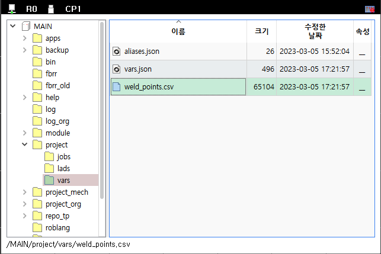

# 6.3.3.3 변수 파일

변수 값들은 전원을 꺼도 보존되어야 하므로 파일로도 저장되는데, 전역변수는 종류에 따라 아래의 2가지 형태로 저장됩니다.

<table>
  <thead>
    <tr>
      <th style="text-align:left">종류</th>
      <th style="text-align:left">경로파일명</th>
      <th style="text-align:left">설명</th>
    </tr>
  </thead>
  <tbody>
    <tr>
      <td style="text-align:left">
        전역 최상위(root) 배열 변수
      </td>
      <td style="text-align:left">MAIN/project/vars/*.csv</td>
      <td style="text-align:left">각 변수마다 파일이 1개씩 생성되며 파일명은 변수명과 동일합니다.</td>
    </tr>
	 <tr>
      <td style="text-align:left">
        나머지 변수
      </td>
      <td style="text-align:left">MAIN/project/vars/vars.json</td>
      <td style="text-align:left">나머지 모든 전역 변수가 하나의 파일로 모아서 저장됩니다.</td>
    </tr>
	</tbody>
</table>

<br>

## vars/.csv 파일

파일관리자에서 `MAIN/project/vars/` 폴더를 열어보면 `weld_points.csv`라는 파일이 생성되어 있습니다. 최상위 레벨에서 배열 변수를 생성하면 변수명과 동일한 .csv 파일이 생성되며, 변수를 삭제하면 해당 파일은 자동으로 삭제됩니다.



이 파일을 USB 메모리나 FTP로 복사하여 PC에서 열어봅시다. .csv 파일은 Comma-Separated Values 즉, 쉼표로 구분된 값들을 표현하는 아주 단순한 표준 텍스트 포맷입니다.

참고 : [위키백과: CSV (파일 형식)](https://ko.wikipedia.org/wiki/CSV_(%ED%8C%8C%EC%9D%BC_%ED%98%95%EC%8B%9D))

.csv 파일은 하나의 2차원 표를 표현하는데, 열은 쉼표로 구분하고 행은 개행으로 구분합니다.


기정의 변수를 저장한 csv 파일은 `weld_points` 2차원 배열을 만들어가는 과정이 순서대로 나열되어 있습니다.

각 행은 1번 째 열은 인덱스, 2번 째 열은 타입, 3번 째~마지막 열은 값입니다. 첫 행은 표의 헤더로서 이를 설명하고 있습니다.

둘 째 행은 최상위 레벨, 즉 `weld_points` 자신을 만드는 행입니다. 따라서 인덱스 열은 비어 있고, 타입은 array, 개수는 10입니다. 즉, 일단 `weld_points[10]`이 만들어지며, 10개의 요소는 기본값인 0들로 채워집니다.

```python
, array, 10
```

다음 행들은 `weld_points[0]`의 요소들에 포즈타입 값을 생성해 대입하는 행입니다.

```python
[0][0], Pose, 0.000, 0.000, 0.000, 0.000, 0.000, 0.000, "base"
[0][1], Pose, 0.000, 0.000, 0.000, 0.000, 0.000, 0.000, "base"
...
```

`weld_points[0]`에 대해 100개의 행이 수행되면 다음은 아래와 같이 `weld_points[1]`에 대한 처리를 수행하는 행들이 이어집니다.

```python
[1], array; 100
[1][0], Pose; 0.000, 0.000, 0.000, 0.000, 0.000, 0.000, "base"
[1][1], Pose; 0.000, 0.000, 0.000, 0.000, 0.000, 0.000, "base"
[1][2], Pose; 0.000, 0.000, 0.000, 0.000, 0.000, 0.000, "base"
...
```

.csv 파일을 파일관리자에서 더블클릭하여, Microsof Excel로 열어 편집할 수 있습니다. 편집이 끝나면 저장 버튼이나 `Ctrl+S`로 저장하십시오.


Excel에서 저장하면 아래와 같이 불필요한 쉼표도 생기고, 좌표계의 따옴표도 사라져서 형식이 약간 변화합니다. Excel이 .csv를 처리하는 방식이므로 어쩔 수 없습니다. 어쨌든 Hi6 제어기는 아래의 형식도 인식하므로 상관없습니다.

```python
, array,10,,,,,,
[0], array,100,,,,,,
[0][0], Pose,0,90,10,0,20,0,
[0][1], Pose,0,0,0,0,0,0,base
[0][2], Pose,0,10,0,0,0,0,robot
[0][3], Pose,0,20,0,0,0,0,base
[0][4], Pose,0,0,0,0,0,0,base
[0][5], Pose,0,0,0,0,0,0,base
```

<br>

## .csv 불러오기

편집한 파일을 다시 `MAIN/project/vars/` 에 덮어쓸 수 있지만, 메모리에 자동 반영되지는 않습니다.

전역변수 창에서 [F2: 전부 불러오기] 버튼을 클릭하면, `vars/` 폴더의 모든 변수 파일을 메모리로 다시 불러옵니다.
(변수 파일을 삭제하고 [F2: 전부 불러오기]를 클릭하면, 메모리의 해당 변수도 삭제되므로 주의하십시오.)

