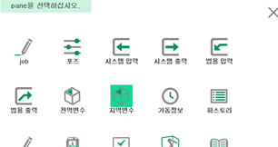
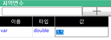

# 6.3.4 本地变量

显示当前调用帧的所有本地变量的列表。您无法创建/删除变量或更改变量名称或类型，但可以编辑值。

1. 拆分屏幕并按左下角的 [选择] 按钮。

&nbsp;

2. 在面板选择窗口中，触摸 `[local variable]`。`局部变量 (local variables)` 面板打开。

3. 检查变量名称、类型和值。改变变量值的方法与前面章节中描述的全局变量相同。

