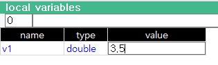

# 6.3.4 지역변수

현재 호출 프레임의 모든 지역 변수의 목록을 표시해줍니다. 변수를 생성/삭제하거나, 변수명, 타입을 변경할 수는 없지만 값을 편집할 수는 있습니다.

1. 화면을 분할하고 좌측 하단의 [선택] 버튼을 누릅니다.

&nbsp;

2.	패널 선택창에서 \[지역변수\]를 터치하십시오. 프로그램에 포함된 지역 변수 목록이 새 창에 나타납니다.

3.	변수 이름과 타입, 값을 확인하십시오. 변수 값을 변경하는 방법은 앞 절에서 설명한 전역변수와 동일합니다.

