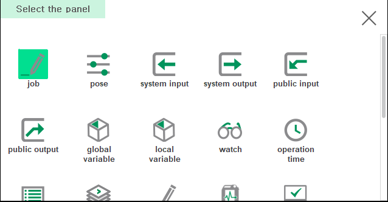
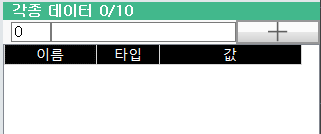
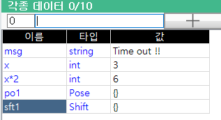
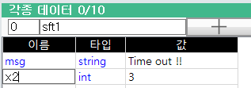
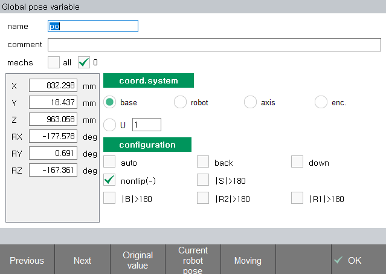

# 6.3.5 监视

您可以将变量或表达式注册到监视面板，以监视或更改值。

#### 打开监视面板

1. 分割屏幕并按左下角的 [选择] 按钮。

&nbsp;

2. 在面板选择窗口中触摸 `监视 (Watch)`。各种数据窗口将打开。

#### 如何使用

在顶部输入框中输入所需的变量或表达式，然后单击 '+' 按钮以将新项输入到表格中。

您可以通过再次单击 `名称 (Name)` 列来修改您输入的变量名称或表达式。

如果您在 `力控制变量 (Value)` 列中单击以输入新值，将更改该变量的值。更改表达式的值将被忽略。

选择姿态/偏移变量或表达式的 `力控制变量 (Value)` 列，然后按 `确认 (ENTER)` 键以打开姿态/偏移属性窗口以查看和修改值。

要删除一行，选择该行并按 `SHIFT+DEL` 键。

如果您在底部的 F 按钮上按 [F7: Save all] 按钮，将输入的变量和表达式列表保存到 `cfg/watch.json` 文件中。该文件在电源重启时会自动加载。
您还可以通过 FTP 将列表接收至外部 PC 进行编辑。如果您用 `cfg/` 文件夹覆盖编辑过的文件并单击 [F1: Load All] 按钮，则会将其应用于监视面板。

单击 [F2: swap up] 和 [F3: swap down] 按钮以在当前选择的行与顶部和底部行交换时移动其位置。

在各种数据窗口中共有 10 页，因此您可以分组和管理想要显示的变量或表达式。单击 [F4: Page] 按钮以显示下一页，单击 `SHIFT`+[F4: Page] 按钮以显示上一页。

您可以使用 [F6: sub.level] 按钮或 `确认 (ENTER)` 键查看数组或对象的元素，使用 [F5: up.level] 按钮或 `ESC` 键可以上移到上一级。

您可以在 `起始索引 (Start Index)` 编辑框中输入值，以从特定索引显示数组。 ([全局变量](3-global-variable/README?cont_model=${cont_model}) 窗口具有相同的操作方法。)


* 为了更新结果值的显示，表达式会在快速周期内不断计算。请小心不要在表达式中包含导致系统特定创建或更改的函数，例如 mkucs()。
