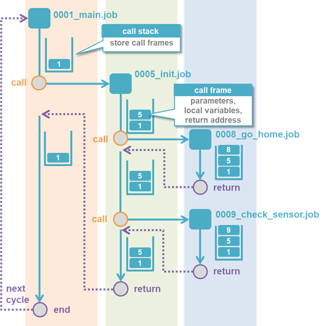
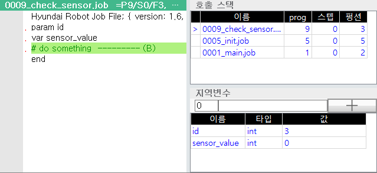
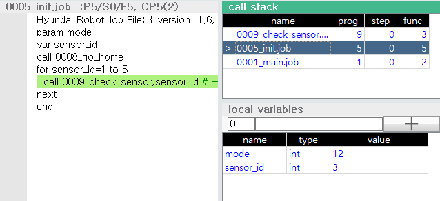

# 6.3.6 调用栈

在面板选择窗口中点击 `[Call Stack]` 显示调用栈窗口。为了理解本节的内容，必须先理解 `call`~`return` 语句和 hrscript 的局部变量。

[调用、跳转语句和子程序](https://hrbook-hrc.web.app/#/view/doc-hrscript/zh/3-flowcontrol-subprogram/7-call-jump/README?cont_model=${cont_model})

[局部变量](https://hrbook-hrc.web.app/#/view/doc-hrscript/zh/3-flowcontrol-subprogram/8-local-global-var/1-local-variables?cont_model=${cont_model})


### 机器人语言的调用和返回

在机器人语言中，可以通过 `call` 语句调用子作业程序。当执行 `end` 或 `return` 语句时，子程序返回到调用它的 `call` 语句的下一个语句位置。例如，在下图中，可以看到作业 5 调用作业 8，进入 `return` 语句，然后继续执行作业 5 的 `call` 语句的下一个语句。



画在程序旁边的容器形状是称为调用栈的存储空间。调用栈构建了当前正在运行程序的调用帧。调用帧包含一组实际参数和局部变量以及作业程序的返回地址。  
因为在调用子程序时新的调用帧被压入栈顶，调用它的程序的局部变量被保存，并准备了新的局部变量空间。  
当子程序返回时，顶层调用帧被丢弃（弹出），下面的调用帧再次成为顶层。因为调用帧保留了调用前的实际参数和区域变量，并且还有返回的位置信息，因此被调用程序可以继续执行在调用前正在做的任务。


### 调用栈面板

可以在调用栈面板中查看当前调用栈的内容。
<br><br>

0001_main.job
```python
var n_work=10
call 0005_init,12
end
```

0005_init.job
```python
param mode
var sensor_id
call 0008_go_home
for sensor_id=1 to 5
  call 0009_check_sensor,sensor_id # --------- (A)
next
end
```

0008_go_home.job
```python
var pos1, pos2
# 做一些事情
end
```

0009_check_sensor.job
```python
param id
var sensor_value
# 做一些事情  --------- (B)
end
```

在作业编辑窗口、调用栈面板和局部变量面板打开的情况下，如果当前程序处于作业 5 的 `for`~`next` 循环中第 3 次执行 `call` 语句并执行到 (B) 位置，教导挂板屏幕将显示如下状态。




调用栈的底部帧是作业 1，中间帧是作业 5，顶部帧是作业 9。> 形状的光标指向作业 9，参数 ` (id)` 和局部变量 `sensor_value` 的值显示在局部变量面板中。因此，可以检查作业 9 是由作业 5 调用的，作业 5 是由作业 1 调用的。  
如果想查看作业 5 的调用位置，选择作业 5 的帧并按 `确认 (ENTER)` 键。作业编辑面板中的光标会立即移动到 (A) 位置以显示其被调用的位置。局部变量面板显示作业 5 的帧内容，即参数 `模式 (mode)` 和局部变量 `sensor_id`，其值分别为 12 和 3。



通过选择被调用作业的帧，可以轻松理解到目前为止的程序流程。


`[caution]` 在执行 Step-FWD 或播放时，务必在恢复操作时将 > 光标恢复到顶部帧位置。否则，作业光标的位置将被视为已更改，调用栈将被初始化。
