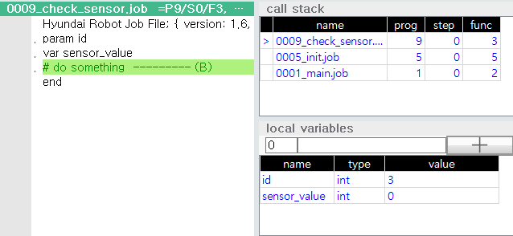

# 6.3.6 call stack

Touch \[Call Stack] in the panel selection window to display the Call Stack window. In order to understand the contents of this section, an understanding of the `call`~`return` statement and local variables of the hrscript must be preceded.

[Call, Jump Statement and Subprograms](https://hrbook-hrc.web.app/#/view/doc-hrscript/english/3-flowcontrol-subprogram/7-call-jump/README)

[Local Variables](https://hrbook-hrc.web.app/#/view/doc-hrscript/english/3-flowcontrol-subprogram/8-local-global-var/1-local-variables)


### Call and Return of Robot Language

In robot language, you can call a sub job program with a `call` statement. When executing `end` or `return` statement, the subprogram returns to the next statement position of the `call` statement that called it. For example, in the figure below, you can see that job 5 calls job 8, run into a `return` statement, and then continues with the next statement of job 5's `call` statement.


The container shape drawn next to the program is a storage space called a call stack. The call stack builds up the call frames of the currently running program. The call frame contains a set of actual parameters and local variables and the return address for the job program.  
Because a new call frame is pushed at the top when a subprogram is called, the local variables of the program that called it are kept and a new local variable space is prepared.  
When the subprogram returns, the top call frame is discarded (pop), and the call frame below it becomes top again. Because the call frame retains the actual parameters and region variables just before the call, and also has position information to return, the called program can continue the task that it was doing just before the call.


### call stack panel

You can view the contents of the current call stack in the Call Stack panel.
<br><br>

0001_main.job
```python
var n_work=10
call 0005_init,12
end
```

0005_init.job
```python
param mode
var sensor_id
call 0008_go_home
for sensor_id=1 to 5
  call 0009_check_sensor,sensor_id # --------- (A)
next
end
```

0008_go_home.job
```python
var pos1, pos2
# do something
end
```

0009_check_sensor.job
```python
param id
var sensor_value
# do something  --------- (B)
end
```

With the job-edit window, the call stack panel, and the local variable panel are open, if the current program is in the state where the `call` statement inside the `for`~`next` loop of job 5 is performed for the 3rd time and executed to the (B) position, the Teach Pendant screen will be in the state shown below.




The bottom frame of the call stack is job 1, the middle frame is job 5, and the top frame is job 9. The > shaped cursor points to job 9, and the values of the parameter `id` and the local variable `sensor_value` are displayed in the local variable panel. Therefore, you can check the information that job 9 was called by job 5, and job 5 was called by job 1.  
If you want to see where job 5 called, select the frame of job 5 and press the `ENTER` key. The cursor in the job edit panel immediately moves to the (A) position to show where it was called. The local variable panel shows the frame contents of job 5, i.e., the parameter `mode` and the local variable `sensor_id`, as 12 and 3 values, respectively.


You can easily understand the flow of the program that has been called so far by selecting the frame of the called job.


\[caution\] When performing Step-FWD or playback, be sure to restore the > cursor to the top frame position when resuming operations. Otherwise, the position of the job cursor is considered to have changed and the call stack is initialized.
