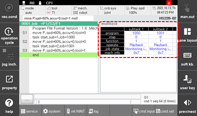

# 6.3.7 多任务

在面板选择窗口中触摸 `[multitask]`。
这将显示在主任务和子任务 1 - 7 中自动运行的程序的信息，包括步骤、功能、操作状态和工作状态。

 


有关详细信息，请参阅 ["${cont_model} 控制器多任务功能手册"](https://hrbook-hrc.web.app/#/view/doc-multi-task/zh/README?cont_model=${cont_model})。
