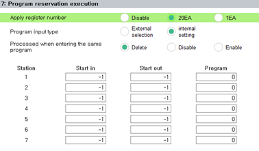
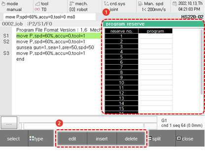

# 6.3.8 程序预约执行

对于此监控，需要预设。您必须在 `系统 - 2:控制参数 - 7:程序预约执行 (system - 2:Control parameter - 7:Program reservation execution)` 页面选择注册号为 20EA 或 1EA。

在面板选择窗口中，触摸 `[program reserve]`。然后，计划程序执行窗口将出现。

当程序通过外部信号安排并按照计划顺序执行时，您可以在已调度程序的列表中检查和更改状态。

<table>
  <thead>
    <tr>
      <th style="text-align:left">编号</th>
      <th style="text-align:left">描述</th>
    </tr>
  </thead>
  <tbody>
    <tr>
      <td style="text-align:left">
        
      </td>
      <td style="text-align:left">
        
已调度程序的列表。您可以调度 1&#x2013;20 个程序。

        <ul>
          <li>当在远程模式下执行的程序被终止时，程序将会依据计划顺序自动执行。</li>
          <li>当已调度程序的执行完成后，这些程序将会从列表中删除。</li>
        </ul>
      </td>
    </tr>
    <tr>
      <td style="text-align:left">
        
      </td>
      <td style="text-align:left">
        <ul>
          <li><b>[编辑]</b>：您可以编辑已调度程序的列表。</li>
          <li><b>[插入]</b>：您可以将按计划执行的程序添加到已调度程序的列表中。</li>
          <li><b>[删除]</b>：您可以从已调度程序的列表中删除已调度程序。</li>
        </ul>
      </td>
    </tr>
  </tbody>
</table>


* 仅当传感器同步功能的同步状态设置为传送带或压机时，`[Program reserve]` 项目才会被激活。
* 如果`[system - 2: Control Parameter - 8: Program reserve]` 菜单中的`[Applied Register Count]`选项设置为禁用，则`[Program reserve]` 项目将不会被激活。
* 有关已调度程序执行的详细信息，请参阅 "${cont_model} 控制器已调度程序执行功能手册。"
