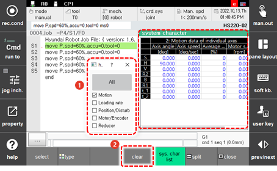
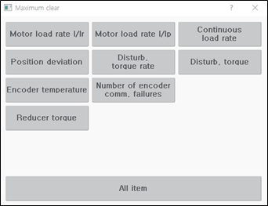

# 6.4.1 系统特征

在面板选择窗口中，触摸 `[System character]`。然后，系统特征窗口将出现。

您可以查看机器人系统的所有各种数据或仅查看特定类型信息的数据。

| No. | 描述 |
| :--- | :--- |
|  | 显示机器人系统的数据。您可以通过选择上面显示的单个类型的信息来查看特定类型的详细数据。 |
|  | `[clear]`：对于每个轴的运动以外的其他项目，您可以按类型将系统数据的最大值初始化为当前值。 |


系统特征监控功能仅在工程师模式下可用。



* 在工程师模式下，工程师模式图标 \(\) 将在状态栏中闪烁。
* 请谨慎操作，因为如果设置不正确，机器人系统可能会出现严重问题。


 

### 初始化

您可以通过选择您想要的信息类型来初始化数据的最大值。

1. 触摸系统属性窗口底部的 `[Clear]` 按钮。

2. 触摸您想要初始化的信息类型。然后，所选项目的最大值将初始化为当前值。

    