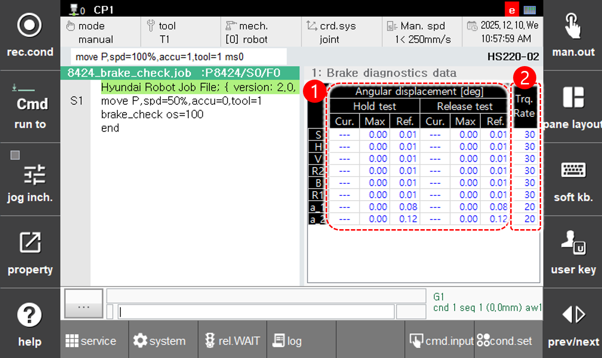

# 6.4.2.1 Brake Diagnostics Monitoring

Touch [Brake Diagnostics] in the button list below to display the brake diagnostics data screen.

<table> 
  <thead> 
    <tr> 
      <th style="text-align:left">No.</th> 
      <th style="text-align:left">Description</th> 
    </tr> 
  </thead> 
<tbody> 
  <tr> 
    <td style="text-align:left"> 
       
    </td> 
    <td style="text-align:left"> 
      <strong>[Angular displacement]</strong>
      
Displays the current angular displacement, maximum angular displacement, and reference angular displacement when torque is applied in the Brake Hold/Release state.
 
      <ul> 
        <li>The current angular displacement is displayed only for the axis under inspection.</li> 
        <li>When the reference value setting mode is active, the axis name is highlighted in yellow.</li> 
      </ul> 
    </td> 
  </tr> 
<tr> 
  <td style="text-align:left">  </td> 
  <td style="text-align:left"> 
    <strong>[Torque rate]</strong>
    
Displays the torque ratio applied during the brake diagnostics.
 
  </td> 
</tr> 
</tbody> 
</table>



* For more details on the brake diagnostic function, refer to the "${cont_model} Robot Controller Function Manual – HRScript Robot Language", section for the "[10.1.16 brake_check](https://hrbook-hrc.web.app/#/view/doc-hrscript/english-${cont_model}/10-etc/1-proc/16-brake_check)" command.

