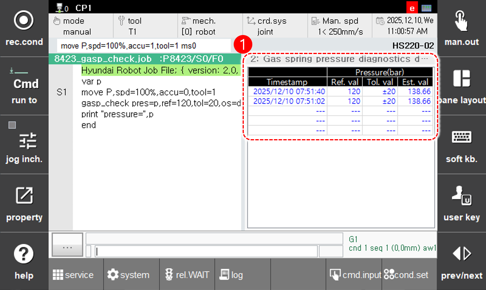

# 6.4.2.2 Gas Spring Pressure Diagnostics Monitoring

Touch [Gas Spring Diagnostics] in the button list below to display the gas spring pressure diagnostics data screen.

<table>
  <thead>
    <tr>
      <th style="text-align:left">No.</th>
      <th style="text-align:left">Description</th>
    </tr>
  </thead>
  <tbody>
    <tr>
      <td style="text-align:left">
        
      </td>
      <td style="text-align:left">
        
Displays the results of the last five gas spring pressure diagnostics.

        <ul>
          <li><strong>[Timestamp]</strong>: Displays the time when the gas spring diagnostic test was performed.</li>
          <li><strong>[Pressure]</strong>: Displays the reference pressure, tolerance, and the estimated pressure.</li>
        </ul>
      </td>
    </tr>
  </tbody>
</table>



* This function is supported only on robots equipped with a gas spring.  
* The estimated gas spring pressure may vary depending on the initial posture at the start of measurement.
During the robot's initial setup, please manage the pressure values based on the measurements taken at each reference posture, and regularly measure the pressure in the same posture to compare it with the initial values.
If a significant difference is observed in the measured values, please inspect the condition of the equipment.
* For more details on the gas spring diagnostic function, refer to the "${cont_model} Robot Controller Function Manual - HRScript Robot Language", section for the "[10.1.7 gasp_check](https://hrbook-hrc.web.app/#/view/doc-hrscript/en/10-etc/1-proc/7-gasp_check)" command.  


