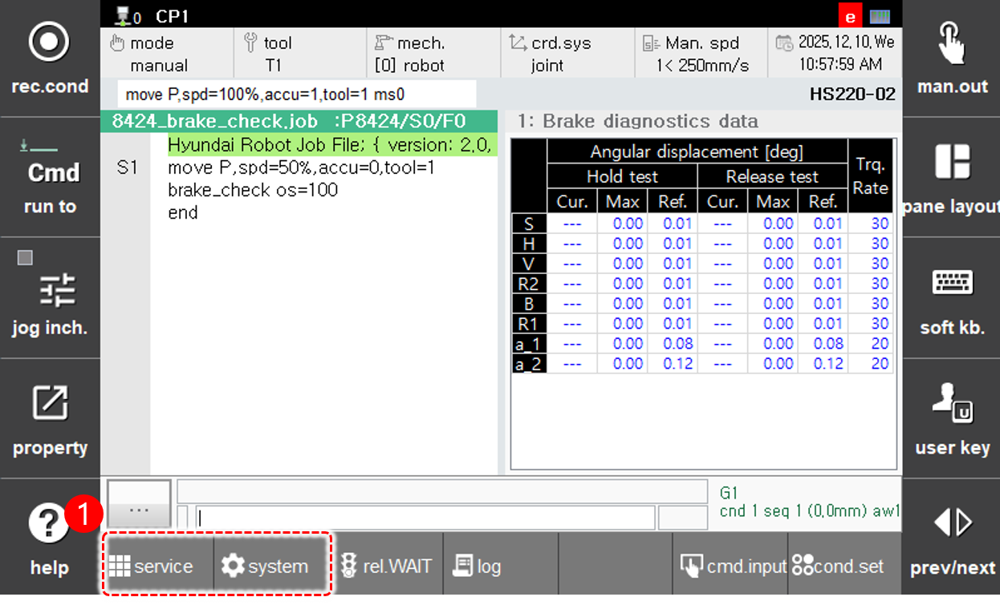

# 6.4.2 System Diagnostics

Touch **[System Diagnostics]** in the panel selection window.
When executed for the first time, the Brake Diagnostics screen appears.

<table> 
  <thead> 
    <tr> 
      <th style="text-align:left">No.</th> 
      <th style="text-align:left">Description</th> 
    </tr> 
  </thead> 
  <tbody> 
    <tr> 
      <td style="text-align:left">  
      </td> 
      <td style="text-align:left"> 
        
 While the <strong>[System Diagnostics]</strong> panel is selected, you can switch to other diagnostic items by tapping the buttons below. 
 
        <ul> 
          <li><strong>[Brake Diagnostics]</strong>: Switches to the brake diagnostics screen.</li> 
          <li><strong>[Gas Spring Diagnostics]</strong>: Switches to the gas spring diagnostics screen.</li> 
        </ul> 
      </td> 
    </tr> 
  </tbody> 
</table>