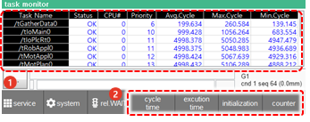

# 6.4.3 任务监视器

在面板选择窗口中，触摸 `[任务监视器]`。然后，任务窗口将出现。

您可以检查每个任务的操作周期和执行时间信息。

<table>
  <thead>
    <tr>
      <th style="text-align:left">编号</th>
      <th style="text-align:left">描述</th>
    </tr>
  </thead>
  <tbody>
    <tr>
      <td style="text-align:left">
        
      </td>
      <td style="text-align:left">
          <ul>显示每个任务的操作周期和执行时间信息</ul>
      </td>
    </tr>
    <tr>
      <td style="text-align:left">
        
      </td>
      <td style="text-align:left">
        <ul>
          <li><b>[周期时间]/[执行时间]</b>: 您可以更改每个任务的信息类型。</li>
          <li><b>[初始化]</b>: 您可以初始化显示的信息。</li>
          <li><b>[计数器]</b>: 通过检查增加的计数器，您可以将任务视为正常。</li>
        </ul>
      </td>
    </tr>
  </tbody>
</table>