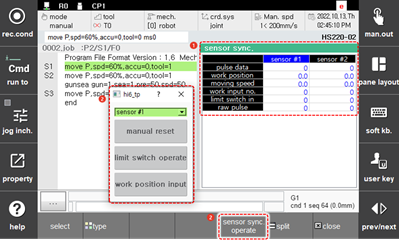

# 6.5.1 传感器同步

在面板选择窗口中触摸 `[Sensor Sync]`。然后，传感器同步窗口将出现。

您可以查看与输送机相关的信息并按下同步功能。通过在 `[system - 4: Application Parameter - 4: Sensor Sync] ([system  - 4: Application Parameter  - 4: Sensor Sync])` 菜单中将同步状态设置为输送机或按压，可以激活传感器同步功能。

<table>
  <thead>
    <tr>
      <th style="text-align:left">编号</th>
      <th style="text-align:left">描述</th>
    </tr>
  </thead>
  <tbody>
    <tr>
      <td style="text-align:left">
        
      </td>
      <td style="text-align:left"> <ul>显示与所选传感器的输送机和按压同步功能相关的信息</ul></td>
    </tr>
    <tr>
      <td style="text-align:left">
        
      </td>
      <td style="text-align:left">
        <ul>
          <li><b>[传感器 #1]</b>: 您可以通过触摸下拉菜单选择要监控的传感器。</li>
          <li><b>[手动重置]</b>: 您可以手动删除各种与传感器相关的数据（编码器脉冲、传感器位置、传感器速度、工件进入计数、同步播放状态等）。</li>
          <li><b>[极限开关操作]</b>: 当您输入时，您可以使用此功能。</li>
          <li><b>[工位输入]</b>: 您可以手动输入传感器位置值（线性：mm，圆形：度）。</li>
        </ul>
      </td>
    </tr>
  </tbody>
</table>


有关传感器同步功能的详细信息，请参阅 ["${cont_model} 传感器同步功能手册。"](https://hrbook-hrc.web.app/#/view/doc-sensor-sync/zh/README?cont_model=${cont_model})
