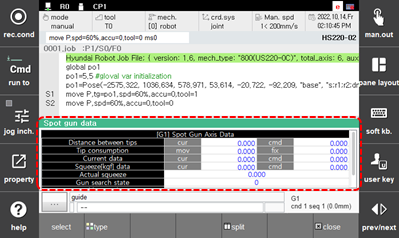

# 6.5.10 Spot Welding Data

Touch \[spot\] in the panel selection window.
This displays the spot gun axis data, the input/output signals and operating information of spot welding.

 

 


 Refer to Spot Welding Manual's “[3.1 Monitoring](https://hrbook-hrc.web.app/#/view/doc-spot-weld/english/3-Related-functions/3-1-monitoring/README)” for more details.

