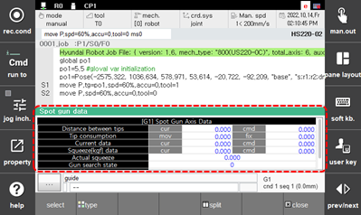

# 6.5.10 点焊数据

在面板选择窗口中触摸 `[spot]`。
这将显示点焊枪的轴数据、输入/输出信号和点焊的操作信息。

 

 


 更多详细信息请参阅点焊手册的 "[3.1 监控](https://hrbook-hrc.web.app/#/view/doc-spot-weld/zh/3-Related-functions/3-1-monitoring/README?cont_model=${cont_model})"。
