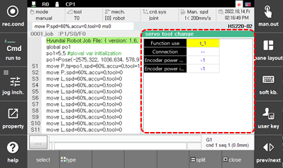

# 6.5.11 伺服工具更换

在面板选择窗口中，触摸 `[servo tool change]`。这将显示伺服工具和编码器电源输入/输出状态在使用伺服工具更换功能时的状态。

 

 


 请参阅 ["${cont_model} 控制器伺服工具更换功能手册"](https://hrbook-hrc.web.app/#/view/doc-svtool-change/zh/README?cont_model=${cont_model}) 以获取更多详细信息。
