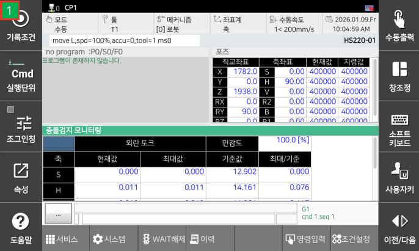
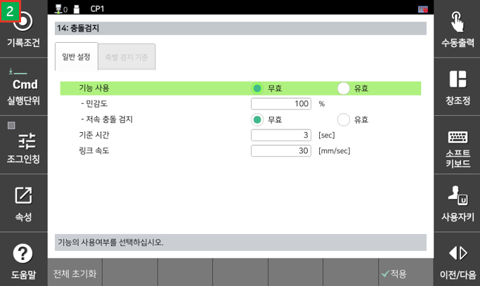

# 6.5.2 碰撞检测监控

 
 
 
#### 描述
* 碰撞检测监控

#### 参数
 - [灵敏度] : 比率值越高，碰撞检测越灵敏。 (0: 禁用) [0~200]
   - 可以在常规选项卡中设置 [系统- 3:机器人参数>14:碰撞检测]  
 - [外部扭矩]-[当前] : 当前估计的外部扭矩 [Nm]
 - [外部扭矩]-[最大] : 当前外部扭矩的最大值 [Nm]
 - [参考] : 阈值扭矩 [Nm]
 - [最大/参考] : 比率 [最大] 与 [参考]，如果该值超过1，轴向冲击将发生。